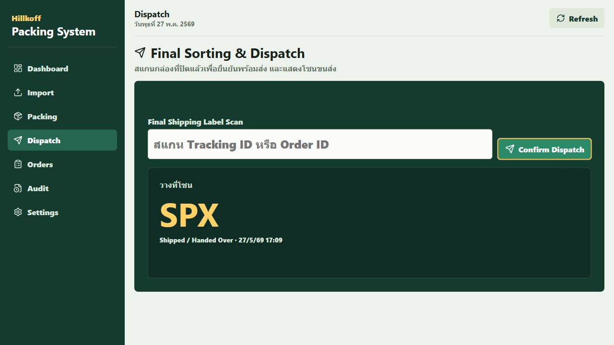

# Order Packing System

ระบบจัดการออเดอร์และการแพ็คสินค้า สำหรับนำเข้าออเดอร์จากหลายช่องทาง ตรวจข้อมูลซ้ำ ตรวจสอบสินค้าระหว่างแพ็ค และคัดแยกตามขนส่งก่อนส่งออก

## Scope

ระบบแบ่งเป็น 3 เฟสหลัก

1. Data Ingestion & Deduplication
2. Packing Verification Process
3. Final Sorting & Dispatch

## Key Features

- Import ออเดอร์จาก Shopee, Lazada, TikTok และใบสั่งจองทั่วไป
- รองรับไฟล์ Excel, CSV, XPS และ API integration
- แปลงข้อมูลแต่ละช่องทางเข้าสู่ Centralized Schema
- ตรวจข้อมูลซ้ำด้วย Tracking ID หรือ Order ID
- Packing Station Dashboard สำหรับพนักงานแพ็ค
- ตรวจ SKU และจำนวนด้วย Barcode / QR Code scan
- แจ้งเตือนเมื่อสแกนสินค้าผิด
- Final scan เพื่อยืนยันว่าพร้อมส่ง
- แสดง Shipping Provider สำหรับคัดแยกกล่อง

## Documentation

- [Workflow Specification](docs/workflow-spec.md)
- [Database Schema](docs/database-schema.md)
- [API Specification](docs/api-spec.md)
- [User Flow](docs/user-flow.md)
- [Maintenance Flow Map](docs/maintenance-flow.md)
- [GitHub Issues Backlog](docs/github-issues.md)
- [Vercel and Firebase Deploy Notes](docs/deploy-vercel-firebase.md)

## Full Web Application

This repository now includes a runnable web app for the full workflow:

- Backend: Express + SQLite
- Frontend: React + Vite
- Import parsing: CSV and XLS/XLSX
- Demo data reset endpoint
- Multi-screen operations UI

### Run Locally

```powershell
npm install
npm run dev
```

Open:

```text
Frontend: http://localhost:5173
Backend:  http://localhost:4000/api/health
```

### Android App Build

This repository includes a native Android shell generated with Capacitor. It packages the React app into a real APK while keeping the normal web deployment working.

```powershell
npm install
npm run android:sync
npm run android:apk
npm run android:release
```

Build behavior:

- App id: `com.hillkoff.packing`
- App name: `Hillkoff Packing`
- Android WebView loads `https://hillkoffzerowaste.github.io/Hillkoffpacking-system/` so deployed web updates can appear in the app without rebuilding the APK
- The bundled web assets are still synced as a native fallback during the Capacitor build
- Data is shared between web and Android only when both use the same Firebase or remote API backend; `local` mode stores data separately per browser/WebView
- Camera permission is declared for barcode scanning
- Cleartext HTTP traffic and app data backup are disabled for production safety

Shared-data deployment:

- Enable Firebase Firestore and Email/Password Authentication
- Create one Firebase Authentication user for the app login
- Add Firebase web config to GitHub repository secrets/variables
- Add GitHub repository variables `VITE_LOGIN_USERNAME` and `VITE_LOGIN_EMAIL`
- Run the `Deploy shared-data web app` GitHub Actions workflow
- Install the signed release APK; Android and browser users will use the same deployed Firebase-backed app

To publish a release APK/AAB, open `android/` in Android Studio, configure a signing key, then build the release artifact from Android Studio or Gradle.

GitHub Pages:

```text
https://hillkoffzerowaste.github.io/Hillkoffpacking-system/
```

On GitHub Pages, the app runs in Firebase mode. Android and browser users share the same Firestore data after signing in with the single configured username/password account.

Vercel deployment files are included:

```text
vercel.json
frontend/.env.example
.env.example
```

Firebase preparation files are included:

```text
frontend/src/lib/firebase.js
frontend/src/lib/firebaseAdapter.js
firebase.json
firestore.rules
firestore.indexes.json
```

Demo scan values:

```text
Packer barcode: EMP001
Order tracking: SPX-TRACK-1001
SKU scan: COF-DRIP-001
Final scan: SPX-TRACK-1001
```

Sample import files are available in `imports/`.

### Application Screens

- Dashboard: real-time operation metrics and shipping queue
- New Order: manual order entry with multiple SKU lines
- Import: marketplace/reservation file import and import history
- Packing: packer identification, order lookup, and SKU scan validation
- Dispatch: final scan with large shipping route display
- Orders: searchable order control center and item detail
- Audit: scan event log for troubleshooting
- Settings: packer and shipping provider setup

Manual order workflow:

```text
New Order -> enter order/tracking/customer -> add SKU and quantity -> Create Ready Order
Packing -> identify packer -> scan tracking -> scan each SKU by quantity
Dispatch -> scan tracking again -> route is displayed
```

Current app screen:



## Suggested Repository Structure

```text
order-packing-system/
├─ docs/
├─ backend/
│  ├─ src/
│  └─ tests/
├─ frontend/
│  ├─ src/
│  └─ tests/
├─ imports/
└─ README.md
```

## Main Status Flow

```text
Imported
-> Deduplicated
-> Ready to Pack
-> Packing In Progress
-> Verified
-> Packed
-> Shipped / Handed Over
```

## Recommended First Milestone

Phase 1 should be implemented first because the packing workflow depends on clean, unique, normalized order data.

Initial tasks:

- Design centralized order schema
- Implement import field mapping per channel
- Implement deduplication logic
- Store order items and shipping provider
- Mark imported orders as Ready to Pack
